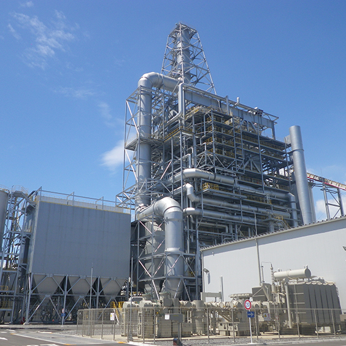

<h1>CFB Boiler Flue Gas Flow for different fuel types - Regression Model </h1>

<h2>Introduction</h2>

We are presented with data inputs and outputs from a Circulating Fluidized Bed (CFB) boiler. The inputs include fuel type and its respective fuel power capacity, and at the output is Flue Gas Flow. The data is in tabular format with daily records for 365 days.
 
*CFB Boiler*

<h2>Aims</h2>

We are trying to work out a model, which will predict the Flue Gas Flow for different fuel mixes.

<h2>Methodology</h2>
We will look into a number of regressors. The main focus is on Linear Regression as the data is fairly limited (ideally we'd appreciate hourly timeframe) and the phenomenon in question is likely of linear nature. 

<h2>Conclusions</h2>

We manage to work out a funciton that gives us reasonably satisfactory results with the R-squared of 0.74. The model fits the data reasonalby well. We will await more info including hourly timeframe and a more varied fuel mix and see how that plays out.
