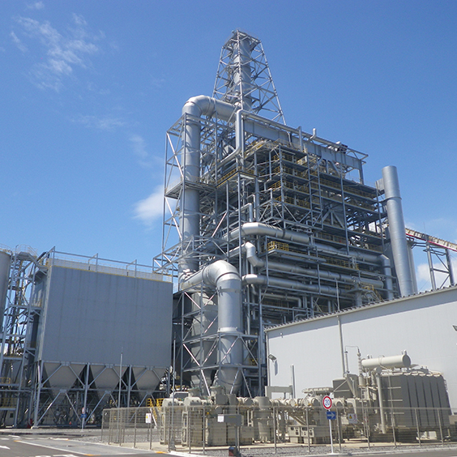
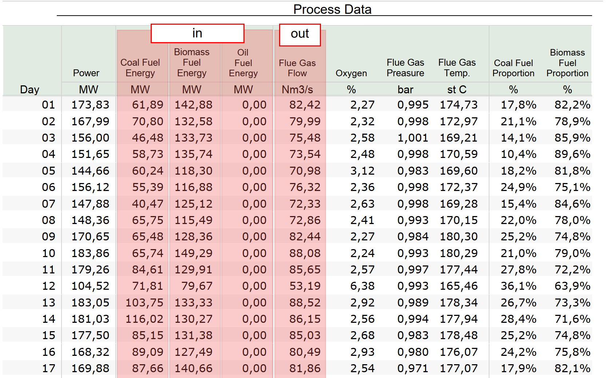

<h1>CFB Boiler Flue Gas Flow for different fuel types - Regression Model </h1>

<h2>Introduction</h2>

We are presented with data inputs and outputs from a Circulating Fluidized Bed (CFB) boiler. The inputs include fuel type and its respective fuel power capacity, and at the output is Flue Gas Flow. The data is in tabular format with daily records for 365 days - please refer to 2023-Process-Data-Monthly-Combined.csv.
 
 
*CFB Boiler*
 
 
*Data used in this excercise - refer to 2023-Process-Data-Monthly-Combined.csv* 
<h2>Aims</h2>

We are trying to work out a model, which will predict the Flue Gas Flow for different fuel mixes and their corresponding fuel power capacity.

<h2>Methodology</h2>
We will load in the data into pandas and then look into a number of regressors. with sklearn The main focus is on Linear Regression as the data is fairly limited (ideally we'd appreciate hourly timeframe) and the phenomenon in question is likely of linear nature. Refer to Regression-models-for-emissions-for-different-fuels.ipynb Jupyter Notebook.

<h2>Conclusions</h2>

We manage to work out a funciton that gives us reasonably satisfactory results with the R-squared of 0.74 (and MSE: 28.56, RMSE: 5.34, and MAE: 4.25). The model fits the data reasonalby well. We will await more info in the future including hourly timestep and a more varied fuel mix and see how that plays out. The likelyhood is that if the data were more extensive, the more sophisticated regressors could outperform the currently best LinearRegression model.
